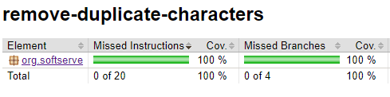

# Delete Duplicate Characters Exercise

This project contains a Java function to delete duplicate characters from a string.

## Functionality

The `deleteDuplicate` function takes a string as input and returns a new string with all duplicate characters removed. It also removes control characters such as `\n`, `\t`, and `\r`.

## Usage

```java
DeleteDuplicate deleteDuplicate = new DeleteDuplicate();
String input = "AABBCCD112233";
String output = deleteDuplicate.deleteDuplicate(input);
System.out.println(output);  // prints: "ABCD123"
```

## Code Coverage

The project uses JaCoCo for code coverage. The JaCoCo plugin is configured in the `build.gradle.kts` file of the project.

To generate a coverage report, run the following command:

```bash
./gradlew test jacocoTestReport
```

### Example Test Coverage Report

